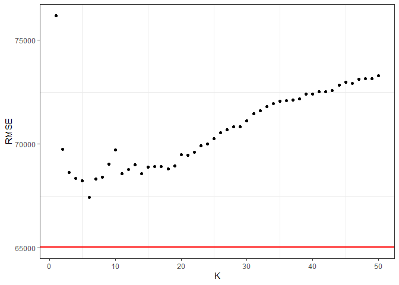

ECO 395M: Exercise 2
====================

Bernardo Arreal Magalhaes - UTEID ba25727

Adhish Luitel - UTEID al49674

Ji Heon Shim - UTEID js93996

Exercise 2.1
------------

In this exercise, we hand-build five models for price in order to find
out the best one which outperforms the "medium" model that we considered
in class.

    model1= price ~ lotSize + age + landValue + livingArea + pctCollege + bedrooms + fireplaces + bathrooms + heating + fuel + sewer + waterfront + newConstruction + centralAir 
    model2= price~ lotSize + age + landValue + livingArea + pctCollege + bedrooms + fireplaces + bathrooms + heating + fuel + centralAir 
    model3= price~ (lotSize + age + landValue + livingArea + pctCollege + bedrooms + fireplaces + bathrooms + heating + fuel + centralAir)^2 
    model4= price~ lotSize + age +pctCollege * landValue + livingArea * (bedrooms + bathrooms) + fireplaces + heating + fuel + centralAir
    model5= price~ lotSize + age + age2 + pctCollege * landValue + livingArea * (bedrooms + bathrooms) + fireplaces + heating + fuel + centralAir

    model_medium = price ~ lotSize + age + livingArea + pctCollege + bedrooms + fireplaces + bathrooms + rooms + heating + fuel + centralAir

Here are the main features of our models.

Model 1 : include all main effects except roooms (exclude rooms because
of colinearity, rooms = bedrooms + batherooms) Model 2: simplify model1
by reducing some variables(-sewer-waterfront-newConstruction) Model 3:
add all the interactions on model 2 Model 4: allow only some
interactions on model 2 Model 5: a polynomial model by adding age^2 on
model 4 Model\_medium: baseline model with 11 main effects

In order to measure performances of each model, we run Monte Carlo
training-test split(train 80%, test 20%) for 100 times and calcaulate
the average values of out-of-sample RMSE for each model.

<table class="table table-striped" style="margin-left: auto; margin-right: auto;">
<thead>
<tr>
<th style="text-align:left;">
</th>
<th style="text-align:right;">
model1
</th>
<th style="text-align:right;">
model2
</th>
<th style="text-align:right;">
model3
</th>
<th style="text-align:right;">
model4
</th>
<th style="text-align:right;">
model5
</th>
<th style="text-align:right;">
model.medium
</th>
</tr>
</thead>
<tbody>
<tr>
<td style="text-align:left;">
AVG RMSE
</td>
<td style="text-align:right;">
58524.25
</td>
<td style="text-align:right;">
60079.23
</td>
<td style="text-align:right;">
63099.46
</td>
<td style="text-align:right;">
59869.86
</td>
<td style="text-align:right;">
59897.52
</td>
<td style="text-align:right;">
65880.39
</td>
</tr>
</tbody>
</table>
The best model turned out to be model 1 with the least out-of-sample
RMSE value. Here is the summary of model 1.

    summ(model1)

<table class="table table-striped table-hover table-condensed table-responsive" style="width: auto !important; margin-left: auto; margin-right: auto;">
<tbody>
<tr>
<td style="text-align:left;font-weight: bold;">
Observations
</td>
<td style="text-align:right;">
1382
</td>
</tr>
<tr>
<td style="text-align:left;font-weight: bold;">
Dependent variable
</td>
<td style="text-align:right;">
price
</td>
</tr>
<tr>
<td style="text-align:left;font-weight: bold;">
Type
</td>
<td style="text-align:right;">
OLS linear regression
</td>
</tr>
</tbody>
</table>
<table class="table table-striped table-hover table-condensed table-responsive" style="width: auto !important; margin-left: auto; margin-right: auto;">
<tbody>
<tr>
<td style="text-align:left;font-weight: bold;">
F(17,1364)
</td>
<td style="text-align:right;">
159.04
</td>
</tr>
<tr>
<td style="text-align:left;font-weight: bold;">
R²
</td>
<td style="text-align:right;">
0.66
</td>
</tr>
<tr>
<td style="text-align:left;font-weight: bold;">
Adj. R²
</td>
<td style="text-align:right;">
0.66
</td>
</tr>
</tbody>
</table>
<table class="table table-striped table-hover table-condensed table-responsive" style="width: auto !important; margin-left: auto; margin-right: auto;">
<thead>
<tr>
<th style="text-align:left;">
</th>
<th style="text-align:right;">
Est.
</th>
<th style="text-align:right;">
S.E.
</th>
<th style="text-align:right;">
t val.
</th>
<th style="text-align:right;">
p
</th>
</tr>
</thead>
<tbody>
<tr>
<td style="text-align:left;font-weight: bold;">
(Intercept)
</td>
<td style="text-align:right;">
122115.02
</td>
<td style="text-align:right;">
20938.79
</td>
<td style="text-align:right;">
5.83
</td>
<td style="text-align:right;">
0.00
</td>
</tr>
<tr>
<td style="text-align:left;font-weight: bold;">
lotSize
</td>
<td style="text-align:right;">
6988.08
</td>
<td style="text-align:right;">
2372.12
</td>
<td style="text-align:right;">
2.95
</td>
<td style="text-align:right;">
0.00
</td>
</tr>
<tr>
<td style="text-align:left;font-weight: bold;">
age
</td>
<td style="text-align:right;">
-119.81
</td>
<td style="text-align:right;">
64.45
</td>
<td style="text-align:right;">
-1.86
</td>
<td style="text-align:right;">
0.06
</td>
</tr>
<tr>
<td style="text-align:left;font-weight: bold;">
landValue
</td>
<td style="text-align:right;">
0.90
</td>
<td style="text-align:right;">
0.05
</td>
<td style="text-align:right;">
17.30
</td>
<td style="text-align:right;">
0.00
</td>
</tr>
<tr>
<td style="text-align:left;font-weight: bold;">
livingArea
</td>
<td style="text-align:right;">
79.02
</td>
<td style="text-align:right;">
4.62
</td>
<td style="text-align:right;">
17.10
</td>
<td style="text-align:right;">
0.00
</td>
</tr>
<tr>
<td style="text-align:left;font-weight: bold;">
pctCollege
</td>
<td style="text-align:right;">
-191.04
</td>
<td style="text-align:right;">
165.51
</td>
<td style="text-align:right;">
-1.15
</td>
<td style="text-align:right;">
0.25
</td>
</tr>
<tr>
<td style="text-align:left;font-weight: bold;">
bedrooms
</td>
<td style="text-align:right;">
-5849.63
</td>
<td style="text-align:right;">
2623.35
</td>
<td style="text-align:right;">
-2.23
</td>
<td style="text-align:right;">
0.03
</td>
</tr>
<tr>
<td style="text-align:left;font-weight: bold;">
fireplaces
</td>
<td style="text-align:right;">
1724.57
</td>
<td style="text-align:right;">
3255.14
</td>
<td style="text-align:right;">
0.53
</td>
<td style="text-align:right;">
0.60
</td>
</tr>
<tr>
<td style="text-align:left;font-weight: bold;">
bathrooms
</td>
<td style="text-align:right;">
22207.53
</td>
<td style="text-align:right;">
3658.98
</td>
<td style="text-align:right;">
6.07
</td>
<td style="text-align:right;">
0.00
</td>
</tr>
<tr>
<td style="text-align:left;font-weight: bold;">
heatinghot water/steam
</td>
<td style="text-align:right;">
-7547.63
</td>
<td style="text-align:right;">
4636.07
</td>
<td style="text-align:right;">
-1.63
</td>
<td style="text-align:right;">
0.10
</td>
</tr>
<tr>
<td style="text-align:left;font-weight: bold;">
heatingelectric
</td>
<td style="text-align:right;">
11284.72
</td>
<td style="text-align:right;">
13449.41
</td>
<td style="text-align:right;">
0.84
</td>
<td style="text-align:right;">
0.40
</td>
</tr>
<tr>
<td style="text-align:left;font-weight: bold;">
fuelelectric
</td>
<td style="text-align:right;">
-19480.65
</td>
<td style="text-align:right;">
13150.73
</td>
<td style="text-align:right;">
-1.48
</td>
<td style="text-align:right;">
0.14
</td>
</tr>
<tr>
<td style="text-align:left;font-weight: bold;">
fueloil
</td>
<td style="text-align:right;">
-3479.01
</td>
<td style="text-align:right;">
5419.64
</td>
<td style="text-align:right;">
-0.64
</td>
<td style="text-align:right;">
0.52
</td>
</tr>
<tr>
<td style="text-align:left;font-weight: bold;">
sewerpublic/commercial
</td>
<td style="text-align:right;">
-1893.46
</td>
<td style="text-align:right;">
4052.18
</td>
<td style="text-align:right;">
-0.47
</td>
<td style="text-align:right;">
0.64
</td>
</tr>
<tr>
<td style="text-align:left;font-weight: bold;">
sewernone
</td>
<td style="text-align:right;">
-611.11
</td>
<td style="text-align:right;">
17728.42
</td>
<td style="text-align:right;">
-0.03
</td>
<td style="text-align:right;">
0.97
</td>
</tr>
<tr>
<td style="text-align:left;font-weight: bold;">
waterfrontNo
</td>
<td style="text-align:right;">
-125457.58
</td>
<td style="text-align:right;">
15971.22
</td>
<td style="text-align:right;">
-7.86
</td>
<td style="text-align:right;">
0.00
</td>
</tr>
<tr>
<td style="text-align:left;font-weight: bold;">
newConstructionNo
</td>
<td style="text-align:right;">
45654.09
</td>
<td style="text-align:right;">
8300.68
</td>
<td style="text-align:right;">
5.50
</td>
<td style="text-align:right;">
0.00
</td>
</tr>
<tr>
<td style="text-align:left;font-weight: bold;">
centralAirNo
</td>
<td style="text-align:right;">
-13047.08
</td>
<td style="text-align:right;">
3897.54
</td>
<td style="text-align:right;">
-3.35
</td>
<td style="text-align:right;">
0.00
</td>
</tr>
</tbody>
<tfoot>
<tr>
<td style="padding: 0; border: 0;" colspan="100%">
 Standard errors: OLS
</td>
</tr>
</tfoot>
</table>
And we can find the variable which is the strongest driver of house
prices by assessing how much it improves the out-of-sample RMSE when it
is included in the model. So we test how much the out-of-sample
increases when we exclude a certain variable from our model 1, and get
the average RMSE by doing Monte Carlo simulation on different
training-test sets(80%-20%) for 100 times.

As the table below shows, "landValue" variable seems to be the storngest
drive of house prices. This result might be caused because land values
are already included in house prices(House price = Land value + Pure
house value), so they are strongly related to each other.

<table class="table table-striped" style="margin-left: auto; margin-right: auto;">
<thead>
<tr>
<th style="text-align:left;">
</th>
<th style="text-align:right;">
AVG RMSE
</th>
</tr>
</thead>
<tbody>
<tr>
<td style="text-align:left;">
model.wo.lotSize
</td>
<td style="text-align:right;">
61593.36
</td>
</tr>
<tr>
<td style="text-align:left;">
model.wo.age
</td>
<td style="text-align:right;">
61423.51
</td>
</tr>
<tr>
<td style="text-align:left;">
model.wo.landValue
</td>
<td style="text-align:right;">
67800.87
</td>
</tr>
<tr>
<td style="text-align:left;">
model.wo.livingArea
</td>
<td style="text-align:right;">
64101.33
</td>
</tr>
<tr>
<td style="text-align:left;">
model.wo.pctCollege
</td>
<td style="text-align:right;">
61259.23
</td>
</tr>
<tr>
<td style="text-align:left;">
model.wo.bedrooms
</td>
<td style="text-align:right;">
61252.39
</td>
</tr>
<tr>
<td style="text-align:left;">
model.wo.fireplaces
</td>
<td style="text-align:right;">
61280.10
</td>
</tr>
<tr>
<td style="text-align:left;">
model.wo.bathrooms
</td>
<td style="text-align:right;">
62158.03
</td>
</tr>
<tr>
<td style="text-align:left;">
model.wo.heating
</td>
<td style="text-align:right;">
61631.86
</td>
</tr>
<tr>
<td style="text-align:left;">
model.wo.fuel
</td>
<td style="text-align:right;">
61251.71
</td>
</tr>
<tr>
<td style="text-align:left;">
model.wo.sewer
</td>
<td style="text-align:right;">
61308.01
</td>
</tr>
<tr>
<td style="text-align:left;">
model.wo.waterfront
</td>
<td style="text-align:right;">
61176.78
</td>
</tr>
<tr>
<td style="text-align:left;">
model.wo.newConstruction
</td>
<td style="text-align:right;">
61961.90
</td>
</tr>
<tr>
<td style="text-align:left;">
model.wo.centralAir
</td>
<td style="text-align:right;">
61123.16
</td>
</tr>
</tbody>
</table>
Now, we build a nonparametic KNN model to compare it with our linear
model and figure out which one performs better. By using the same train
and test sets that we used in our linear regression, the result shows
that whatever value K may have, the knn model is unlikely to perfrom
better than our linear model. In the graph below, the horizontal red
line shows the out-of-sample RMSE of our linear model. We can see that
all the RMSEs of the knn model in accordance with k values are plotted
above the red line. And the table below suggests the fact that the
minimum RMSE value of knn model is still bigger than our best-fit linear
model.

<table class="table table-striped" style="width: auto !important; margin-left: auto; margin-right: auto;">
<thead>
<tr>
<th style="text-align:right;">
Kmin
</th>
<th style="text-align:right;">
knn.model.RMSE
</th>
<th style="text-align:right;">
linear.model.RMSE
</th>
</tr>
</thead>
<tbody>
<tr>
<td style="text-align:right;">
6
</td>
<td style="text-align:right;">
66375.15
</td>
<td style="text-align:right;">
61749.77
</td>
</tr>
</tbody>
</table>
But there is random variation due to the particular choice of data
points that end up in your train/test split. So we run Monte-Carlo
simulation again using random train/test split for 100 times, and
compare the minimim RMSE of knn model with RMSE of our linear model. As
a result, we can see that our linear model outperforms the knn model.

<table class="table table-striped" style="margin-left: auto; margin-right: auto;">
<thead>
<tr>
<th style="text-align:left;">
</th>
<th style="text-align:right;">
knn.model
</th>
<th style="text-align:right;">
linear.model
</th>
</tr>
</thead>
<tbody>
<tr>
<td style="text-align:left;">
Average RMSE
</td>
<td style="text-align:right;">
62454.55
</td>
<td style="text-align:right;">
58524.25
</td>
</tr>
</tbody>
</table>
Exercise 2.2
------------

This exercise is based on a dataset consisting of 987 screening
mammograms administered at a hospital in Seattle, Washington. The goal
of the analysis is to evaluate the performance of five different
radiologists considering several risk factors.

First, we analyzed the raw data to verify whether each radiologist has a
different recall rate (A.recallrate) or not, and compare precision
(B.cancerrate) and false negative (C.false\_negative) rates. We can
observe that, even though radiologist89 has a higher probability of
recalling patients, his false negative error rate (not recalling
patients that actually have cancer) doesn't substantially differ from
radiologist95 and radiologist34, who have the lowest recall rates.

However, since each radiologist read the mammograms of a different set
of patients, this difference could be explained by the fact that some
radiologists might have seen patients whose clinical situation required
them to be recalled for further examination.

In order to analyse if, holding patient risk factors equal, some
radiologists are more clinically conservative than others in recalling
patients, we built two classification models:

    model1 = recall ~ radiologist + age + history + symptoms + menopause + density
    model2 = recall ~ (age + history + symptoms + menopause + density) * radiologist

The table below shows the Average Marginal Effect (AME) for each
radiologist in the two models. We can see that, when using Model 1,
radiologist89 is the most conservative - holding patient risk factors
equal, the probability of being recalled increases by 5.71 percentage
points when radiologist89 is the one reading the mammogram compared to
the baseline radiologist13.

When allowing for interactions between radiologist and each control
variable as in Model 2, radiologist89 is still the most conservative -
holding patient risk factors equal, the probability of being recalled
increases by 17.48 percentage points when radiologist89 is the one
reading the mammogram compared to the baseline radiologist13.

<table class="table table-striped" style="margin-left: auto; margin-right: auto;">
<thead>
<tr>
<th style="border-bottom:hidden" colspan="1">
</th>
<th style="border-bottom:hidden; padding-bottom:0; padding-left:3px;padding-right:3px;text-align: center; " colspan="2">
Model 1

</th>
<th style="border-bottom:hidden; padding-bottom:0; padding-left:3px;padding-right:3px;text-align: center; " colspan="2">
Model 2

</th>
</tr>
<tr>
<th style="text-align:left;">
</th>
<th style="text-align:right;">
AME
</th>
<th style="text-align:right;">
se
</th>
<th style="text-align:right;">
AME
</th>
<th style="text-align:right;">
se
</th>
</tr>
</thead>
<tbody>
<tr>
<td style="text-align:left;">
radiologist.34
</td>
<td style="text-align:right;">
-0.0642539
</td>
<td style="text-align:right;">
0.0466605
</td>
<td style="text-align:right;">
-0.0367519
</td>
<td style="text-align:right;">
0.2862899
</td>
</tr>
<tr>
<td style="text-align:left;">
radiologist.66
</td>
<td style="text-align:right;">
0.0436803
</td>
<td style="text-align:right;">
0.0340582
</td>
<td style="text-align:right;">
0.0395334
</td>
<td style="text-align:right;">
0.1134616
</td>
</tr>
<tr>
<td style="text-align:left;">
radiologist.89
</td>
<td style="text-align:right;">
0.0571172
</td>
<td style="text-align:right;">
0.0362476
</td>
<td style="text-align:right;">
0.1748448
</td>
<td style="text-align:right;">
0.1882719
</td>
</tr>
<tr>
<td style="text-align:left;">
radiologist.95
</td>
<td style="text-align:right;">
-0.0064281
</td>
<td style="text-align:right;">
0.0319132
</td>
<td style="text-align:right;">
-0.2994109
</td>
<td style="text-align:right;">
0.2105251
</td>
</tr>
</tbody>
</table>
Finally, in order to estimate how each radiologist would perform when
facing the same set of patients, we used a bootstrap to randomly split
the original dataset in a training dataset containing 80% of the
observations and a testing a dataset containing 20% of the observations,
repeating the proccess 100 times. In each repetition, we fitted both
models using the train dataset, and compared each model's predictions
when all radiologists, in a hypothetical scenario, analyze the entire
test dataset.

We computed average probability of recall per repetition, and calculated
the average of the 100 samples to mitigate the effect of randomization.
For both models, radiologist89 has the highest probability of recall,
followed by radiologist66, radiologist13, radiologist95 and radiologist
34.

<table class="table table-striped" style="margin-left: auto; margin-right: auto;">
<thead>
<tr>
<th style="border-bottom:hidden" colspan="1">
</th>
<th style="border-bottom:hidden; padding-bottom:0; padding-left:3px;padding-right:3px;text-align: center; " colspan="2">
(Out of sample) Average recall probability

</th>
</tr>
<tr>
<th style="text-align:left;">
radiologist
</th>
<th style="text-align:right;">
Model\_1
</th>
<th style="text-align:right;">
Model\_2
</th>
</tr>
</thead>
<tbody>
<tr>
<td style="text-align:left;">
radiologist.13
</td>
<td style="text-align:right;">
0.1383483
</td>
<td style="text-align:right;">
0.1376463
</td>
</tr>
<tr>
<td style="text-align:left;">
radiologist.34
</td>
<td style="text-align:right;">
0.0882825
</td>
<td style="text-align:right;">
0.0886276
</td>
</tr>
<tr>
<td style="text-align:left;">
radiologist.66
</td>
<td style="text-align:right;">
0.1879345
</td>
<td style="text-align:right;">
0.1941092
</td>
</tr>
<tr>
<td style="text-align:left;">
radiologist.89
</td>
<td style="text-align:right;">
0.1985145
</td>
<td style="text-align:right;">
0.2264008
</td>
</tr>
<tr>
<td style="text-align:left;">
radiologist.95
</td>
<td style="text-align:right;">
0.1332161
</td>
<td style="text-align:right;">
0.1235210
</td>
</tr>
</tbody>
</table>
The results corroborate what we observed in the AME table, that some
radiologists are more clinically conservative than others in recalling
patients, even holding patient risk factors equal.

After that, we analyzed if the data suggests that radiologists at this
hospital should be weighting some clinical risk factors more heavily
than they currently are when interpreting mammograms in order to make a
decision on whether to recall a patient or not.

We started by stablishing the following baseline model.

    baseline_model = cancer ~ recall

Then, we built multiple models adding each of the clinical risk factors
to the baseline model to evaluate the results separately.

    baseline_history_model = cancer ~ recall + history
    baseline_age_model = cancer ~ recall + age
    baseline_symptoms_model = cancer ~ recall + symptoms
    baseline_menopause_model = cancer ~ recall + menopause
    baseline_density_model = cancer ~ recall + density

If the radiologists were appropriately accounting for the clinical risk
factors when deciding whether to recall a patient for further
examination, we would expect the coefficient associated with the recall
variable to capture this effect, and the coefficient of the control
variable to be close to zero (so the odds ratio to be close to one).
Hence, including this variables in the model shouldn't considerably
affect the cancer predictions.

The table below summarizes the estimates from the 6 models. Here, we
observe that age 70 plus, density 4 (extremely dense) and
post-menopausal/unknown hormone-therapy status are some factors that are
increasing the odds of having a cancer, even after medical analysis!
Thus there's extra information in the risk factors that the doctors
should be weighting more heavily to recall patients than they currently
are.

<table style="border-collapse:collapse; border:none;">
<tr>
<th style="border-top: double; text-align:center; font-style:normal; font-weight:bold; padding:0.2cm;  text-align:left; ">
 
</th>
<th colspan="2" style="border-top: double; text-align:center; font-style:normal; font-weight:bold; padding:0.2cm; ">
Baseline Model
</th>
<th colspan="2" style="border-top: double; text-align:center; font-style:normal; font-weight:bold; padding:0.2cm; ">
+History
</th>
<th colspan="2" style="border-top: double; text-align:center; font-style:normal; font-weight:bold; padding:0.2cm; ">
+Age
</th>
<th colspan="2" style="border-top: double; text-align:center; font-style:normal; font-weight:bold; padding:0.2cm; ">
+Symptoms
</th>
<th colspan="2" style="border-top: double; text-align:center; font-style:normal; font-weight:bold; padding:0.2cm; ">
+Menopause
</th>
<th colspan="2" style="border-top: double; text-align:center; font-style:normal; font-weight:bold; padding:0.2cm; ">
+Density
</th>
</tr>
<tr>
<td style=" text-align:center; border-bottom:1px solid; font-style:italic; font-weight:normal;  text-align:left; ">
Predictors
</td>
<td style=" text-align:center; border-bottom:1px solid; font-style:italic; font-weight:normal;  ">
Odds Ratios
</td>
<td style=" text-align:center; border-bottom:1px solid; font-style:italic; font-weight:normal;  ">
p
</td>
<td style=" text-align:center; border-bottom:1px solid; font-style:italic; font-weight:normal;  ">
Odds Ratios
</td>
<td style=" text-align:center; border-bottom:1px solid; font-style:italic; font-weight:normal;  ">
p
</td>
<td style=" text-align:center; border-bottom:1px solid; font-style:italic; font-weight:normal;  ">
Odds Ratios
</td>
<td style=" text-align:center; border-bottom:1px solid; font-style:italic; font-weight:normal;  col7">
p
</td>
<td style=" text-align:center; border-bottom:1px solid; font-style:italic; font-weight:normal;  col8">
Odds Ratios
</td>
<td style=" text-align:center; border-bottom:1px solid; font-style:italic; font-weight:normal;  col9">
p
</td>
<td style=" text-align:center; border-bottom:1px solid; font-style:italic; font-weight:normal;  0">
Odds Ratios
</td>
<td style=" text-align:center; border-bottom:1px solid; font-style:italic; font-weight:normal;  1">
p
</td>
<td style=" text-align:center; border-bottom:1px solid; font-style:italic; font-weight:normal;  2">
Odds Ratios
</td>
<td style=" text-align:center; border-bottom:1px solid; font-style:italic; font-weight:normal;  3">
p
</td>
</tr>
<tr>
<td style=" padding:0.2cm; text-align:left; vertical-align:top; text-align:left; ">
(Intercept)
</td>
<td style=" padding:0.2cm; text-align:left; vertical-align:top; text-align:center;  ">
0.02
</td>
<td style=" padding:0.2cm; text-align:left; vertical-align:top; text-align:center;  ">
<strong>&lt;0.001
</td>
<td style=" padding:0.2cm; text-align:left; vertical-align:top; text-align:center;  ">
0.02
</td>
<td style=" padding:0.2cm; text-align:left; vertical-align:top; text-align:center;  ">
<strong>&lt;0.001
</td>
<td style=" padding:0.2cm; text-align:left; vertical-align:top; text-align:center;  ">
0.01
</td>
<td style=" padding:0.2cm; text-align:left; vertical-align:top; text-align:center;  col7">
<strong>&lt;0.001
</td>
<td style=" padding:0.2cm; text-align:left; vertical-align:top; text-align:center;  col8">
0.02
</td>
<td style=" padding:0.2cm; text-align:left; vertical-align:top; text-align:center;  col9">
<strong>&lt;0.001
</td>
<td style=" padding:0.2cm; text-align:left; vertical-align:top; text-align:center;  0">
0.02
</td>
<td style=" padding:0.2cm; text-align:left; vertical-align:top; text-align:center;  1">
<strong>&lt;0.001
</td>
<td style=" padding:0.2cm; text-align:left; vertical-align:top; text-align:center;  2">
0.01
</td>
<td style=" padding:0.2cm; text-align:left; vertical-align:top; text-align:center;  3">
<strong>&lt;0.001
</td>
</tr>
<tr>
<td style=" padding:0.2cm; text-align:left; vertical-align:top; text-align:left; ">
recall
</td>
<td style=" padding:0.2cm; text-align:left; vertical-align:top; text-align:center;  ">
9.59
</td>
<td style=" padding:0.2cm; text-align:left; vertical-align:top; text-align:center;  ">
<strong>&lt;0.001
</td>
<td style=" padding:0.2cm; text-align:left; vertical-align:top; text-align:center;  ">
9.55
</td>
<td style=" padding:0.2cm; text-align:left; vertical-align:top; text-align:center;  ">
<strong>&lt;0.001
</td>
<td style=" padding:0.2cm; text-align:left; vertical-align:top; text-align:center;  ">
10.28
</td>
<td style=" padding:0.2cm; text-align:left; vertical-align:top; text-align:center;  col7">
<strong>&lt;0.001
</td>
<td style=" padding:0.2cm; text-align:left; vertical-align:top; text-align:center;  col8">
9.49
</td>
<td style=" padding:0.2cm; text-align:left; vertical-align:top; text-align:center;  col9">
<strong>&lt;0.001
</td>
<td style=" padding:0.2cm; text-align:left; vertical-align:top; text-align:center;  0">
9.63
</td>
<td style=" padding:0.2cm; text-align:left; vertical-align:top; text-align:center;  1">
<strong>&lt;0.001
</td>
<td style=" padding:0.2cm; text-align:left; vertical-align:top; text-align:center;  2">
9.58
</td>
<td style=" padding:0.2cm; text-align:left; vertical-align:top; text-align:center;  3">
<strong>&lt;0.001
</td>
</tr>
<tr>
<td style=" padding:0.2cm; text-align:left; vertical-align:top; text-align:left; ">
history
</td>
<td style=" padding:0.2cm; text-align:left; vertical-align:top; text-align:center;  ">
</td>
<td style=" padding:0.2cm; text-align:left; vertical-align:top; text-align:center;  ">
</td>
<td style=" padding:0.2cm; text-align:left; vertical-align:top; text-align:center;  ">
1.23
</td>
<td style=" padding:0.2cm; text-align:left; vertical-align:top; text-align:center;  ">
0.626
</td>
<td style=" padding:0.2cm; text-align:left; vertical-align:top; text-align:center;  ">
</td>
<td style=" padding:0.2cm; text-align:left; vertical-align:top; text-align:center;  col7">
</td>
<td style=" padding:0.2cm; text-align:left; vertical-align:top; text-align:center;  col8">
</td>
<td style=" padding:0.2cm; text-align:left; vertical-align:top; text-align:center;  col9">
</td>
<td style=" padding:0.2cm; text-align:left; vertical-align:top; text-align:center;  0">
</td>
<td style=" padding:0.2cm; text-align:left; vertical-align:top; text-align:center;  1">
</td>
<td style=" padding:0.2cm; text-align:left; vertical-align:top; text-align:center;  2">
</td>
<td style=" padding:0.2cm; text-align:left; vertical-align:top; text-align:center;  3">
</td>
</tr>
<tr>
<td style=" padding:0.2cm; text-align:left; vertical-align:top; text-align:left; ">
age \[5059\]
</td>
<td style=" padding:0.2cm; text-align:left; vertical-align:top; text-align:center;  ">
</td>
<td style=" padding:0.2cm; text-align:left; vertical-align:top; text-align:center;  ">
</td>
<td style=" padding:0.2cm; text-align:left; vertical-align:top; text-align:center;  ">
</td>
<td style=" padding:0.2cm; text-align:left; vertical-align:top; text-align:center;  ">
</td>
<td style=" padding:0.2cm; text-align:left; vertical-align:top; text-align:center;  ">
1.21
</td>
<td style=" padding:0.2cm; text-align:left; vertical-align:top; text-align:center;  col7">
0.697
</td>
<td style=" padding:0.2cm; text-align:left; vertical-align:top; text-align:center;  col8">
</td>
<td style=" padding:0.2cm; text-align:left; vertical-align:top; text-align:center;  col9">
</td>
<td style=" padding:0.2cm; text-align:left; vertical-align:top; text-align:center;  0">
</td>
<td style=" padding:0.2cm; text-align:left; vertical-align:top; text-align:center;  1">
</td>
<td style=" padding:0.2cm; text-align:left; vertical-align:top; text-align:center;  2">
</td>
<td style=" padding:0.2cm; text-align:left; vertical-align:top; text-align:center;  3">
</td>
</tr>
<tr>
<td style=" padding:0.2cm; text-align:left; vertical-align:top; text-align:left; ">
age \[6069\]
</td>
<td style=" padding:0.2cm; text-align:left; vertical-align:top; text-align:center;  ">
</td>
<td style=" padding:0.2cm; text-align:left; vertical-align:top; text-align:center;  ">
</td>
<td style=" padding:0.2cm; text-align:left; vertical-align:top; text-align:center;  ">
</td>
<td style=" padding:0.2cm; text-align:left; vertical-align:top; text-align:center;  ">
</td>
<td style=" padding:0.2cm; text-align:left; vertical-align:top; text-align:center;  ">
0.88
</td>
<td style=" padding:0.2cm; text-align:left; vertical-align:top; text-align:center;  col7">
0.833
</td>
<td style=" padding:0.2cm; text-align:left; vertical-align:top; text-align:center;  col8">
</td>
<td style=" padding:0.2cm; text-align:left; vertical-align:top; text-align:center;  col9">
</td>
<td style=" padding:0.2cm; text-align:left; vertical-align:top; text-align:center;  0">
</td>
<td style=" padding:0.2cm; text-align:left; vertical-align:top; text-align:center;  1">
</td>
<td style=" padding:0.2cm; text-align:left; vertical-align:top; text-align:center;  2">
</td>
<td style=" padding:0.2cm; text-align:left; vertical-align:top; text-align:center;  3">
</td>
</tr>
<tr>
<td style=" padding:0.2cm; text-align:left; vertical-align:top; text-align:left; ">
age \[70plus\]
</td>
<td style=" padding:0.2cm; text-align:left; vertical-align:top; text-align:center;  ">
</td>
<td style=" padding:0.2cm; text-align:left; vertical-align:top; text-align:center;  ">
</td>
<td style=" padding:0.2cm; text-align:left; vertical-align:top; text-align:center;  ">
</td>
<td style=" padding:0.2cm; text-align:left; vertical-align:top; text-align:center;  ">
</td>
<td style=" padding:0.2cm; text-align:left; vertical-align:top; text-align:center;  ">
2.51
</td>
<td style=" padding:0.2cm; text-align:left; vertical-align:top; text-align:center;  col7">
<strong>0.047</strong>
</td>
<td style=" padding:0.2cm; text-align:left; vertical-align:top; text-align:center;  col8">
</td>
<td style=" padding:0.2cm; text-align:left; vertical-align:top; text-align:center;  col9">
</td>
<td style=" padding:0.2cm; text-align:left; vertical-align:top; text-align:center;  0">
</td>
<td style=" padding:0.2cm; text-align:left; vertical-align:top; text-align:center;  1">
</td>
<td style=" padding:0.2cm; text-align:left; vertical-align:top; text-align:center;  2">
</td>
<td style=" padding:0.2cm; text-align:left; vertical-align:top; text-align:center;  3">
</td>
</tr>
<tr>
<td style=" padding:0.2cm; text-align:left; vertical-align:top; text-align:left; ">
symptoms
</td>
<td style=" padding:0.2cm; text-align:left; vertical-align:top; text-align:center;  ">
</td>
<td style=" padding:0.2cm; text-align:left; vertical-align:top; text-align:center;  ">
</td>
<td style=" padding:0.2cm; text-align:left; vertical-align:top; text-align:center;  ">
</td>
<td style=" padding:0.2cm; text-align:left; vertical-align:top; text-align:center;  ">
</td>
<td style=" padding:0.2cm; text-align:left; vertical-align:top; text-align:center;  ">
</td>
<td style=" padding:0.2cm; text-align:left; vertical-align:top; text-align:center;  col7">
</td>
<td style=" padding:0.2cm; text-align:left; vertical-align:top; text-align:center;  col8">
1.30
</td>
<td style=" padding:0.2cm; text-align:left; vertical-align:top; text-align:center;  col9">
0.686
</td>
<td style=" padding:0.2cm; text-align:left; vertical-align:top; text-align:center;  0">
</td>
<td style=" padding:0.2cm; text-align:left; vertical-align:top; text-align:center;  1">
</td>
<td style=" padding:0.2cm; text-align:left; vertical-align:top; text-align:center;  2">
</td>
<td style=" padding:0.2cm; text-align:left; vertical-align:top; text-align:center;  3">
</td>
</tr>
<tr>
<td style=" padding:0.2cm; text-align:left; vertical-align:top; text-align:left; ">
menopause \[postmenoNoHT\]
</td>
<td style=" padding:0.2cm; text-align:left; vertical-align:top; text-align:center;  ">
</td>
<td style=" padding:0.2cm; text-align:left; vertical-align:top; text-align:center;  ">
</td>
<td style=" padding:0.2cm; text-align:left; vertical-align:top; text-align:center;  ">
</td>
<td style=" padding:0.2cm; text-align:left; vertical-align:top; text-align:center;  ">
</td>
<td style=" padding:0.2cm; text-align:left; vertical-align:top; text-align:center;  ">
</td>
<td style=" padding:0.2cm; text-align:left; vertical-align:top; text-align:center;  col7">
</td>
<td style=" padding:0.2cm; text-align:left; vertical-align:top; text-align:center;  col8">
</td>
<td style=" padding:0.2cm; text-align:left; vertical-align:top; text-align:center;  col9">
</td>
<td style=" padding:0.2cm; text-align:left; vertical-align:top; text-align:center;  0">
0.98
</td>
<td style=" padding:0.2cm; text-align:left; vertical-align:top; text-align:center;  1">
0.971
</td>
<td style=" padding:0.2cm; text-align:left; vertical-align:top; text-align:center;  2">
</td>
<td style=" padding:0.2cm; text-align:left; vertical-align:top; text-align:center;  3">
</td>
</tr>
<tr>
<td style=" padding:0.2cm; text-align:left; vertical-align:top; text-align:left; ">
menopause \[postmenounknown\]
</td>
<td style=" padding:0.2cm; text-align:left; vertical-align:top; text-align:center;  ">
</td>
<td style=" padding:0.2cm; text-align:left; vertical-align:top; text-align:center;  ">
</td>
<td style=" padding:0.2cm; text-align:left; vertical-align:top; text-align:center;  ">
</td>
<td style=" padding:0.2cm; text-align:left; vertical-align:top; text-align:center;  ">
</td>
<td style=" padding:0.2cm; text-align:left; vertical-align:top; text-align:center;  ">
</td>
<td style=" padding:0.2cm; text-align:left; vertical-align:top; text-align:center;  col7">
</td>
<td style=" padding:0.2cm; text-align:left; vertical-align:top; text-align:center;  col8">
</td>
<td style=" padding:0.2cm; text-align:left; vertical-align:top; text-align:center;  col9">
</td>
<td style=" padding:0.2cm; text-align:left; vertical-align:top; text-align:center;  0">
2.16
</td>
<td style=" padding:0.2cm; text-align:left; vertical-align:top; text-align:center;  1">
0.279
</td>
<td style=" padding:0.2cm; text-align:left; vertical-align:top; text-align:center;  2">
</td>
<td style=" padding:0.2cm; text-align:left; vertical-align:top; text-align:center;  3">
</td>
</tr>
<tr>
<td style=" padding:0.2cm; text-align:left; vertical-align:top; text-align:left; ">
menopause \[premeno\]
</td>
<td style=" padding:0.2cm; text-align:left; vertical-align:top; text-align:center;  ">
</td>
<td style=" padding:0.2cm; text-align:left; vertical-align:top; text-align:center;  ">
</td>
<td style=" padding:0.2cm; text-align:left; vertical-align:top; text-align:center;  ">
</td>
<td style=" padding:0.2cm; text-align:left; vertical-align:top; text-align:center;  ">
</td>
<td style=" padding:0.2cm; text-align:left; vertical-align:top; text-align:center;  ">
</td>
<td style=" padding:0.2cm; text-align:left; vertical-align:top; text-align:center;  col7">
</td>
<td style=" padding:0.2cm; text-align:left; vertical-align:top; text-align:center;  col8">
</td>
<td style=" padding:0.2cm; text-align:left; vertical-align:top; text-align:center;  col9">
</td>
<td style=" padding:0.2cm; text-align:left; vertical-align:top; text-align:center;  0">
0.85
</td>
<td style=" padding:0.2cm; text-align:left; vertical-align:top; text-align:center;  1">
0.711
</td>
<td style=" padding:0.2cm; text-align:left; vertical-align:top; text-align:center;  2">
</td>
<td style=" padding:0.2cm; text-align:left; vertical-align:top; text-align:center;  3">
</td>
</tr>
<tr>
<td style=" padding:0.2cm; text-align:left; vertical-align:top; text-align:left; ">
density \[2\]
</td>
<td style=" padding:0.2cm; text-align:left; vertical-align:top; text-align:center;  ">
</td>
<td style=" padding:0.2cm; text-align:left; vertical-align:top; text-align:center;  ">
</td>
<td style=" padding:0.2cm; text-align:left; vertical-align:top; text-align:center;  ">
</td>
<td style=" padding:0.2cm; text-align:left; vertical-align:top; text-align:center;  ">
</td>
<td style=" padding:0.2cm; text-align:left; vertical-align:top; text-align:center;  ">
</td>
<td style=" padding:0.2cm; text-align:left; vertical-align:top; text-align:center;  col7">
</td>
<td style=" padding:0.2cm; text-align:left; vertical-align:top; text-align:center;  col8">
</td>
<td style=" padding:0.2cm; text-align:left; vertical-align:top; text-align:center;  col9">
</td>
<td style=" padding:0.2cm; text-align:left; vertical-align:top; text-align:center;  0">
</td>
<td style=" padding:0.2cm; text-align:left; vertical-align:top; text-align:center;  1">
</td>
<td style=" padding:0.2cm; text-align:left; vertical-align:top; text-align:center;  2">
1.95
</td>
<td style=" padding:0.2cm; text-align:left; vertical-align:top; text-align:center;  3">
0.533
</td>
</tr>
<tr>
<td style=" padding:0.2cm; text-align:left; vertical-align:top; text-align:left; ">
density \[3\]
</td>
<td style=" padding:0.2cm; text-align:left; vertical-align:top; text-align:center;  ">
</td>
<td style=" padding:0.2cm; text-align:left; vertical-align:top; text-align:center;  ">
</td>
<td style=" padding:0.2cm; text-align:left; vertical-align:top; text-align:center;  ">
</td>
<td style=" padding:0.2cm; text-align:left; vertical-align:top; text-align:center;  ">
</td>
<td style=" padding:0.2cm; text-align:left; vertical-align:top; text-align:center;  ">
</td>
<td style=" padding:0.2cm; text-align:left; vertical-align:top; text-align:center;  col7">
</td>
<td style=" padding:0.2cm; text-align:left; vertical-align:top; text-align:center;  col8">
</td>
<td style=" padding:0.2cm; text-align:left; vertical-align:top; text-align:center;  col9">
</td>
<td style=" padding:0.2cm; text-align:left; vertical-align:top; text-align:center;  0">
</td>
<td style=" padding:0.2cm; text-align:left; vertical-align:top; text-align:center;  1">
</td>
<td style=" padding:0.2cm; text-align:left; vertical-align:top; text-align:center;  2">
1.95
</td>
<td style=" padding:0.2cm; text-align:left; vertical-align:top; text-align:center;  3">
0.526
</td>
</tr>
<tr>
<td style=" padding:0.2cm; text-align:left; vertical-align:top; text-align:left; ">
density \[4\]
</td>
<td style=" padding:0.2cm; text-align:left; vertical-align:top; text-align:center;  ">
</td>
<td style=" padding:0.2cm; text-align:left; vertical-align:top; text-align:center;  ">
</td>
<td style=" padding:0.2cm; text-align:left; vertical-align:top; text-align:center;  ">
</td>
<td style=" padding:0.2cm; text-align:left; vertical-align:top; text-align:center;  ">
</td>
<td style=" padding:0.2cm; text-align:left; vertical-align:top; text-align:center;  ">
</td>
<td style=" padding:0.2cm; text-align:left; vertical-align:top; text-align:center;  col7">
</td>
<td style=" padding:0.2cm; text-align:left; vertical-align:top; text-align:center;  col8">
</td>
<td style=" padding:0.2cm; text-align:left; vertical-align:top; text-align:center;  col9">
</td>
<td style=" padding:0.2cm; text-align:left; vertical-align:top; text-align:center;  0">
</td>
<td style=" padding:0.2cm; text-align:left; vertical-align:top; text-align:center;  1">
</td>
<td style=" padding:0.2cm; text-align:left; vertical-align:top; text-align:center;  2">
5.05
</td>
<td style=" padding:0.2cm; text-align:left; vertical-align:top; text-align:center;  3">
0.137
</td>
</tr>
<tr>
<td style=" padding:0.2cm; text-align:left; vertical-align:top; text-align:left; padding-top:0.1cm; padding-bottom:0.1cm; border-top:1px solid;">
Observations
</td>
<td style=" padding:0.2cm; text-align:left; vertical-align:top; padding-top:0.1cm; padding-bottom:0.1cm; text-align:left; border-top:1px solid;" colspan="2">
987
</td>
<td style=" padding:0.2cm; text-align:left; vertical-align:top; padding-top:0.1cm; padding-bottom:0.1cm; text-align:left; border-top:1px solid;" colspan="2">
987
</td>
<td style=" padding:0.2cm; text-align:left; vertical-align:top; padding-top:0.1cm; padding-bottom:0.1cm; text-align:left; border-top:1px solid;" colspan="2">
987
</td>
<td style=" padding:0.2cm; text-align:left; vertical-align:top; padding-top:0.1cm; padding-bottom:0.1cm; text-align:left; border-top:1px solid;" colspan="2">
987
</td>
<td style=" padding:0.2cm; text-align:left; vertical-align:top; padding-top:0.1cm; padding-bottom:0.1cm; text-align:left; border-top:1px solid;" colspan="2">
987
</td>
<td style=" padding:0.2cm; text-align:left; vertical-align:top; padding-top:0.1cm; padding-bottom:0.1cm; text-align:left; border-top:1px solid;" colspan="2">
987
</td>
</tr>
<tr>
<td style=" padding:0.2cm; text-align:left; vertical-align:top; text-align:left; padding-top:0.1cm; padding-bottom:0.1cm;">
R2 Tjur
</td>
<td style=" padding:0.2cm; text-align:left; vertical-align:top; padding-top:0.1cm; padding-bottom:0.1cm; text-align:left;" colspan="2">
0.060
</td>
<td style=" padding:0.2cm; text-align:left; vertical-align:top; padding-top:0.1cm; padding-bottom:0.1cm; text-align:left;" colspan="2">
0.060
</td>
<td style=" padding:0.2cm; text-align:left; vertical-align:top; padding-top:0.1cm; padding-bottom:0.1cm; text-align:left;" colspan="2">
0.076
</td>
<td style=" padding:0.2cm; text-align:left; vertical-align:top; padding-top:0.1cm; padding-bottom:0.1cm; text-align:left;" colspan="2">
0.061
</td>
<td style=" padding:0.2cm; text-align:left; vertical-align:top; padding-top:0.1cm; padding-bottom:0.1cm; text-align:left;" colspan="2">
0.065
</td>
<td style=" padding:0.2cm; text-align:left; vertical-align:top; padding-top:0.1cm; padding-bottom:0.1cm; text-align:left;" colspan="2">
0.069
</td>
</tr>
</table>
Considering the results above, we built a new model including those 3
risk factors.

    proposed_model = cancer ~ recall + age.70plus + postmenounknown + density.4

In order to assess how well this model performs when predicting cancer
status, we need to compare its predictions with the predictions from the
baseline model.

The confusion matrix for the baseline model below shows that the doctors
are currently predicting cancer with a 59.46% sensitivity (22/(22+15))
and a accuracy rate of 85.71% ((824+22)/987).

    ##       recall
    ## cancer   0   1
    ##      0 824 126
    ##      1  15  22

Considering the in-sample probability of cancer as a threshold for the
fitted values of the proposed model to predict cancer or not, we
computed the following confusion matrix. This matrix shows that, when
including age.70plus, postmenounknown and density.4 in the model, the
sensitivity increased to 64.86 (24/(13+24)) but the accuracy rate
slightly decreased to 84.60% ((811+24)/987).

    ##    yhat
    ## y     0   1
    ##   0 811 139
    ##   1  13  24

Since a cancer that is diagnosed at an early stage is more likely to be
treated successfully, it is reasonable to argue that the increase in
sensitivity overcomes the decrease in the accuracy rates caused by a
higher amount of false positive predictions. Hence, our best judgement
is that the radiologists should be weighting more heavily patients with
70 years old and above, density 4 (extremely dense) and
post-menopausal/unknown hormone-therapy status when deciding whether to
recall patients.
