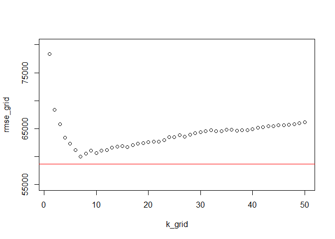

\#ECO 395M: Exercise 2

Bernardo Arreal Magalhaes - UTEID ba25727

Adhish Luitel - UTEID al49674

Ji Heon Shim - UTEID js93996

Exercise 2.1
------------

In this exercise, we hand-build five models for price in order to find
out the best one which outperforms the “medium” model that we considered
in class.

    model1= price ~ lotSize + age + landValue + livingArea + pctCollege + bedrooms + fireplaces + bathrooms + heating + fuel + sewer + waterfront + newConstruction + centralAir 
    model2= price~ lotSize + age + landValue + livingArea + pctCollege + bedrooms + fireplaces + bathrooms + heating + fuel + centralAir 
    model3= price~ (lotSize + age + landValue + livingArea + pctCollege + bedrooms + fireplaces + bathrooms + heating + fuel + centralAir)^2 
    model4= price~ lotSize + age +pctCollege * landValue + livingArea * (bedrooms + bathrooms) + fireplaces + heating + fuel + centralAir
    model5= price~ lotSize + age + age2 + pctCollege * landValue + livingArea * (bedrooms + bathrooms) + fireplaces + heating + fuel + centralAir

    model_medium = price ~ lotSize + age + livingArea + pctCollege + bedrooms + fireplaces + bathrooms + rooms + heating + fuel + centralAir

Here are the main features of our models.

Model 1 : include all main effects except roooms (exclude rooms because
of colinearity, rooms = bedrooms + batherooms) Model 2: simplify model1
by reducing some variables(-sewer-waterfront-newConstruction) Model 3:
add all the interactions on model 2 Model 4: allow only some
interactions on model 2 Model 5: a polynomial model by adding age^2 on
model 4 Model\_medium: baseline model with 11 main effects

In order to measure performances of each model, we run Monte Carlo
training-test split(train 80%, test 20%) for 100 times and calcaulate
the average values of out-of-sample RMSE for each model.

<table class="table table-striped" style="margin-left: auto; margin-right: auto;">
<thead>
<tr>
<th style="text-align:left;">
</th>
<th style="text-align:right;">
model1
</th>
<th style="text-align:right;">
model2
</th>
<th style="text-align:right;">
model3
</th>
<th style="text-align:right;">
model4
</th>
<th style="text-align:right;">
model5
</th>
<th style="text-align:right;">
model\_medium
</th>
</tr>
</thead>
<tbody>
<tr>
<td style="text-align:left;">
AVG\_RMSE
</td>
<td style="text-align:right;">
58240.41
</td>
<td style="text-align:right;">
59924.11
</td>
<td style="text-align:right;">
63207.77
</td>
<td style="text-align:right;">
59800.62
</td>
<td style="text-align:right;">
59805.86
</td>
<td style="text-align:right;">
65822.75
</td>
</tr>
</tbody>
</table>

The best model turned out to be model 1 with the least out-of-sample
RMSE value. Here is the summary of model 1.

    summary(model1)

    ## 
    ## Call:
    ## lm(formula = price ~ . - rooms - age2, data = saratoga_train)
    ## 
    ## Residuals:
    ##     Min      1Q  Median      3Q     Max 
    ## -223652  -35696   -6131   27799  400603 
    ## 
    ## Coefficients:
    ##                          Estimate Std. Error t value Pr(>|t|)    
    ## (Intercept)             9.872e+04  2.256e+04   4.376 1.30e-05 ***
    ## lotSize                 5.703e+03  2.787e+03   2.046  0.04091 *  
    ## age                    -1.328e+02  6.522e+01  -2.036  0.04195 *  
    ## landValue               9.664e-01  5.313e-02  18.190  < 2e-16 ***
    ## livingArea              7.439e+01  4.733e+00  15.718  < 2e-16 ***
    ## pctCollege             -1.975e+02  1.694e+02  -1.166  0.24384    
    ## bedrooms               -4.870e+03  2.698e+03  -1.805  0.07135 .  
    ## fireplaces              4.175e+03  3.340e+03   1.250  0.21144    
    ## bathrooms               2.385e+04  3.736e+03   6.385 2.35e-10 ***
    ## heatinghot water/steam -1.129e+04  4.760e+03  -2.373  0.01779 *  
    ## heatingelectric         1.240e+04  1.510e+04   0.821  0.41152    
    ## fuelelectric           -2.077e+04  1.481e+04  -1.402  0.16109    
    ## fueloil                -3.268e+03  5.642e+03  -0.579  0.56251    
    ## sewerpublic/commercial  6.575e+02  4.090e+03   0.161  0.87231    
    ## sewernone              -6.005e+02  1.797e+04  -0.033  0.97335    
    ## waterfrontNo           -1.073e+05  1.749e+04  -6.134 1.12e-09 ***
    ## newConstructionNo       4.873e+04  8.293e+03   5.876 5.28e-09 ***
    ## centralAirNo           -1.188e+04  3.949e+03  -3.008  0.00268 ** 
    ## ---
    ## Signif. codes:  0 '***' 0.001 '**' 0.01 '*' 0.05 '.' 0.1 ' ' 1
    ## 
    ## Residual standard error: 58470 on 1364 degrees of freedom
    ## Multiple R-squared:  0.6509, Adjusted R-squared:  0.6465 
    ## F-statistic: 149.6 on 17 and 1364 DF,  p-value: < 2.2e-16

And we can find the variable which is the strongest driver of house
prices by assessing how much it improves the out-of-sample RMSE when it
is included in the model. So we test how much the out-of-sample
increases when we exclude a certain variable from our model 1, and get
the average RMSE by doing Monte Carlo simulation on different
training-test sets(80%-20%) for 100 times.

As the table below shows, “landValue” variable seems to be the storngest
drive of house prices. This result might be caused because land values
are already included in house prices(House price = Land value + Pure
house value), so they are strongly related to each other.

<table class="table table-striped" style="margin-left: auto; margin-right: auto;">
<thead>
<tr>
<th style="text-align:left;">
</th>
<th style="text-align:right;">
AVG RMSE
</th>
</tr>
</thead>
<tbody>
<tr>
<td style="text-align:left;">
model\_wo\_lotSize
</td>
<td style="text-align:right;">
58538.94
</td>
</tr>
<tr>
<td style="text-align:left;">
model\_wo\_age
</td>
<td style="text-align:right;">
57924.38
</td>
</tr>
<tr>
<td style="text-align:left;">
model\_wo\_landValue
</td>
<td style="text-align:right;">
61790.80
</td>
</tr>
<tr>
<td style="text-align:left;">
model\_wo\_livingArea
</td>
<td style="text-align:right;">
63693.41
</td>
</tr>
<tr>
<td style="text-align:left;">
model\_wo\_pctCollege
</td>
<td style="text-align:right;">
57809.96
</td>
</tr>
<tr>
<td style="text-align:left;">
model\_wo\_bedrooms
</td>
<td style="text-align:right;">
57920.00
</td>
</tr>
<tr>
<td style="text-align:left;">
model\_wo\_fireplaces
</td>
<td style="text-align:right;">
57818.34
</td>
</tr>
<tr>
<td style="text-align:left;">
model\_wo\_bathrooms
</td>
<td style="text-align:right;">
58381.75
</td>
</tr>
<tr>
<td style="text-align:left;">
model\_wo\_heating
</td>
<td style="text-align:right;">
57922.66
</td>
</tr>
<tr>
<td style="text-align:left;">
model\_wo\_fuel
</td>
<td style="text-align:right;">
57820.87
</td>
</tr>
<tr>
<td style="text-align:left;">
model\_wo\_sewer
</td>
<td style="text-align:right;">
57894.34
</td>
</tr>
<tr>
<td style="text-align:left;">
model\_wo\_waterfront
</td>
<td style="text-align:right;">
59555.30
</td>
</tr>
<tr>
<td style="text-align:left;">
model\_wo\_newConstruction
</td>
<td style="text-align:right;">
58234.72
</td>
</tr>
<tr>
<td style="text-align:left;">
model\_wo\_centralAir
</td>
<td style="text-align:right;">
57771.45
</td>
</tr>
</tbody>
</table>

Now, we build a nonparametic KNN model to compare it with our linear
model and figure out which one performs better. By using the same train
and test sets that we used in our linear regression, the result shows
that whatever value K may have, the knn model is unlikely to perfrom
better than our linear model. In the graph below, the horizontal red
line shows the out-of-sample RMSE of our linear model. We can see that
all the RMSEs of the knn model in accordance with k values are plotted
above the red line. And the table below suggests the fact that the
minimum RMSE value of knn model is still bigger than our best-fit linear
model.

<table class="table table-striped" style="width: auto !important; margin-left: auto; margin-right: auto;">
<thead>
<tr>
<th style="text-align:right;">
Kmin
</th>
<th style="text-align:right;">
knn.model.RMSE
</th>
<th style="text-align:right;">
linear.model.RMSE
</th>
</tr>
</thead>
<tbody>
<tr>
<td style="text-align:right;">
14
</td>
<td style="text-align:right;">
68783.07
</td>
<td style="text-align:right;">
58733.91
</td>
</tr>
</tbody>
</table>

But there is random variation due to the particular choice of data
points that end up in your train/test split. So we run Monte-Carlo
simulation again using random train/test split for 100 times, and
compare the minimim RMSE of knn model with RMSE of our linear model. As
a result, we can see that our linear model outperforms the knn model.

<table class="table table-striped" style="margin-left: auto; margin-right: auto;">
<thead>
<tr>
<th style="text-align:left;">
</th>
<th style="text-align:right;">
knn\_model
</th>
<th style="text-align:right;">
linear\_model
</th>
</tr>
</thead>
<tbody>
<tr>
<td style="text-align:left;">
Average\_RMSE
</td>
<td style="text-align:right;">
61840.61
</td>
<td style="text-align:right;">
58240.41
</td>
</tr>
</tbody>
</table>
